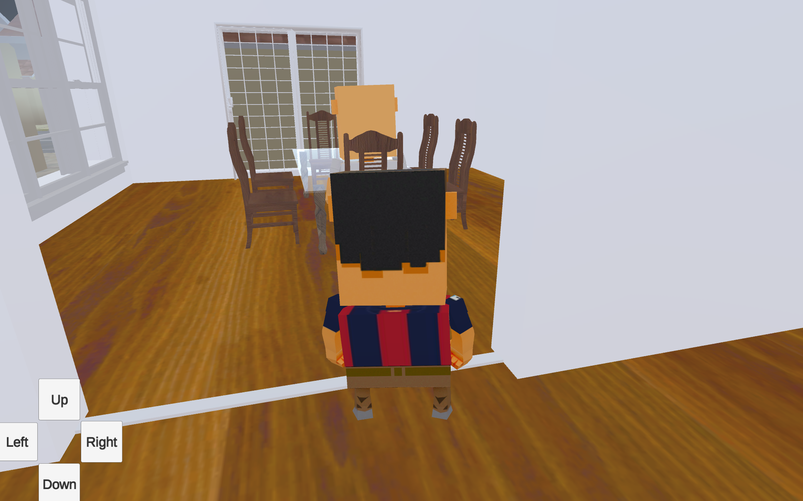
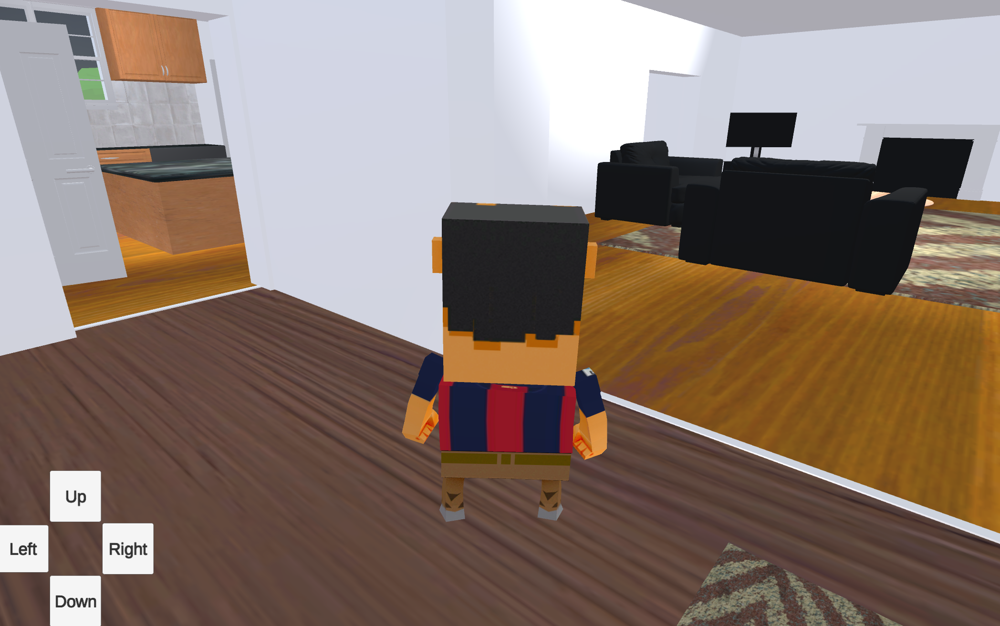
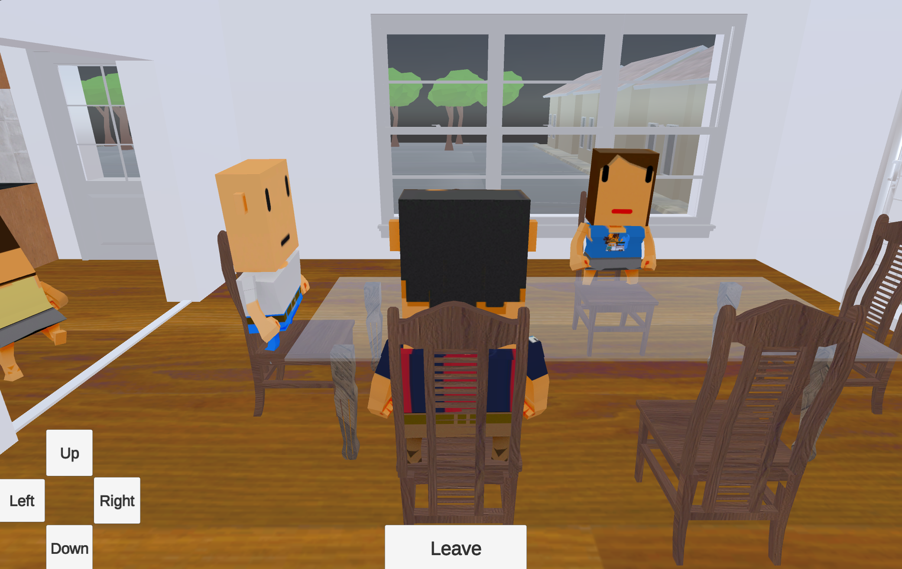
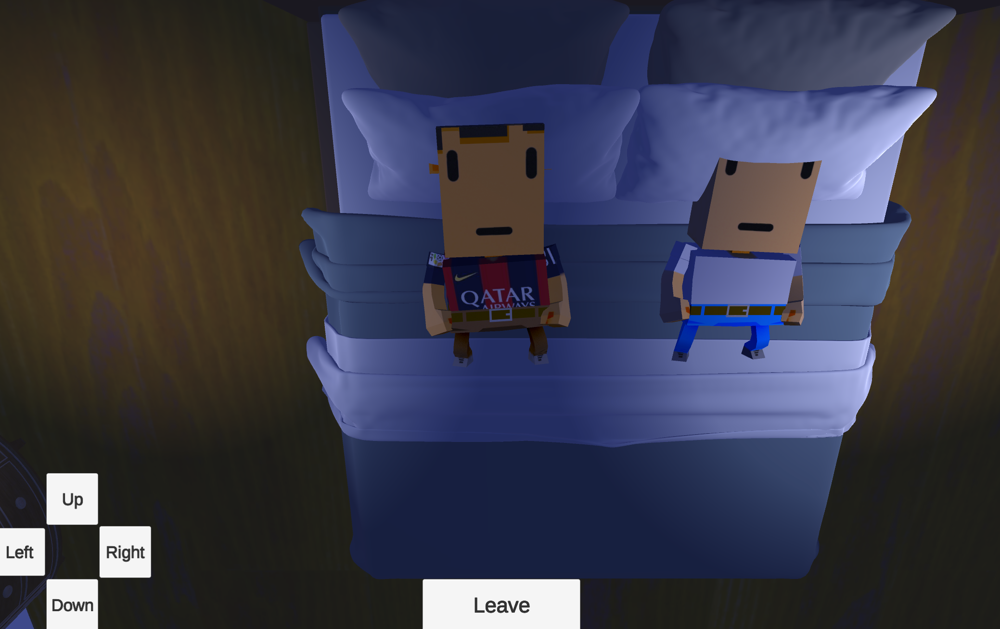
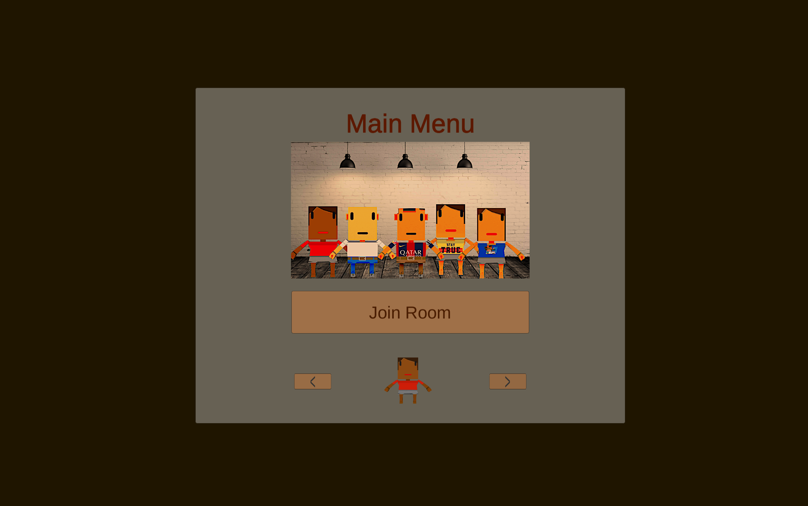

# Old House Unity Game

A Unity-based game project set in an old house environment. This project includes various assets, scripts, and scenes to create an immersive experience.

## Features

- **3D Models:** Includes a 3D model of the house and its surroundings with Blender.
- **Scripts:** Contains C# scripts to control game mechanics and interactions.
- **Scenes:** Pre-built scenes to showcase different parts of the game environment.
- **Prefabs:** Ready-to-use prefabs for quick scene assembly.
- **NPC Pathfinding:** Non-player characters (NPCs) have pathfinders, allowing them to find the optimal route to their destinations.
- **RNG Schedules:** NPCs have randomized schedules, ensuring they perform different actions each day for a dynamic game experience.
- **Object Interactions:** Players can interact with certain objects, such as sitting on chairs or sleeping on beds.
- **Multiplayer Support:** The game uses Photon Unity Networking (PUN) for multiplayer functionality, enabling players to connect and play together through a client-server solution.
- **Dynamic Time and Day Cycle:** The game features a real-time dynamic time and day cycle, enhancing the immersive experience.

## Snapshots






## Prerequisites

- Unity 2020.3 or above
- Basic understanding of C# and Unity

## Installation

1. Clone the repository:
   ```sh
   git clone https://github.com/ndaniel20/old-house-unity-game.git
   ```
2. Open the project in Unity Hub.
3. Load the scene from the `Scenes` folder to get started.

## Usage

- Explore the pre-built scenes to understand the game environment.
- Modify and extend the scenes or scripts as per your requirements.
- Use the prefabs to quickly build and test new game features.

## Play the Game

You can play the game via this [link to Simmer.io](https://simmer.io/@ndaniel10/carthage)
